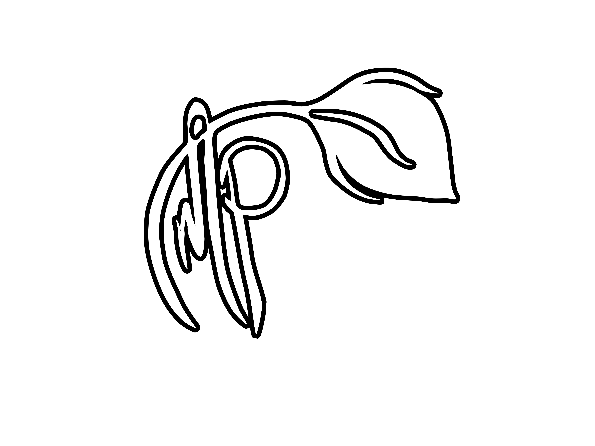

# EpiMood
A personal project to create a full-stack app to track mood disorder activity.


## Installation
To be determined

[](https://www.figma.com/file/UupxxFQW8aS4RbZh7oCZKN/Untitled?node-id=0%3A1) 

<summary>
CURRENT TODO LIST:
</summary>
<p><ul>
<li>- [ ] Planning and wireframe</li>
<li>- [ ] Planning and wireframe</li>
<li>- [ ] Planning and wireframe</li>
</ul>
</p>
</details>


## User Story

```md
As a person with PMDD
I need to track my emotional state
So that I can find patterns and better structure my schedule around my disorder.
```


